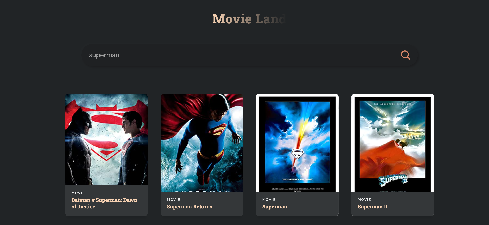

<!-- Please update value in the {}  -->

<h1 align="center">Movie App</h1>

<!-- 

   Solution for a challenge from  <a href="http://devchallenges.io" target="_blank">Devchallenges.io</a>.

 -->

  <h3>
    <a href="https://fn-movies-app.netlify.app"
    target="_blank">
      Live Demo
    </a>
    <!--  | 
    <a href="https://github.com/favour33/error-404">
      Code 
    </a> -->
    <!--  | 
    <a href="https://devchallenges.io/challenges/wBunSb7FPrIepJZAg0sY">
      Challenge
    </a> -->
  </h3>

<!-- TABLE OF CONTENTS -->

## Table of Contents

- [Overview](#overview)
- [Built With](#built-with)
- [Features](#features)
- [Contact](#contact)
- [Acknowledgements](#acknowledgements)

<!-- OVERVIEW -->

## Overview

 

### Where can I see a live demo? <a href="#" target="_blank" > {Name} </a>

 

### What is it?  

 
Dynamic web application where users can search for movies based on the title, the application then queries the OMBD API and returns any matching movies based on the search, resulting movies are then presented in a modern card format. Responsive on mobile, tablet and desktop screens.

 

### What have i learned/improved? 

 

- CSS styling
- Using API in dynamic application

 

## Built With

<!-- This section should list any major frameworks that you built your project using. Here are a few examples.-->

- ReactJS

 

## Features

<!-- List the features of your application or follow the template. Don't share the figma file here :) -->

- Search For Movie based on name

 

## Acknowledgements

<!-- This section should list any articles or add-ons/plugins that helps you to complete the project. This is optional but it will help you in the future. For exmpale -->

- [OMBD API](https://www.omdbapi.com)

 

## Contact

<!-- - Website [your-website.com](https://{your-web-site-link}) -->

- GitHub [@favour33](https://github.com/favour33)
- linkedin [@Favour Nwachukwu](https://www.linkedin.com/in/fn84/})
